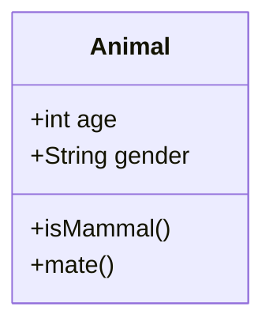

```mermaid
raph TD;
      A-->B;
      A-->C;
      B-->D;
      C-->D;
```

# Librairie `physique` pour Python

## Module `modélisation`

Classe `modele`

```mermaid
classDiagram
    Animal: +int age
    Animal: +String gender
    Animal: +isMammal()
    Animal: +mate()
```
